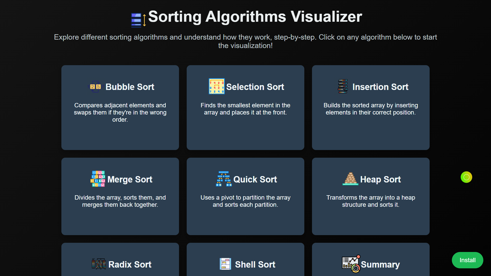
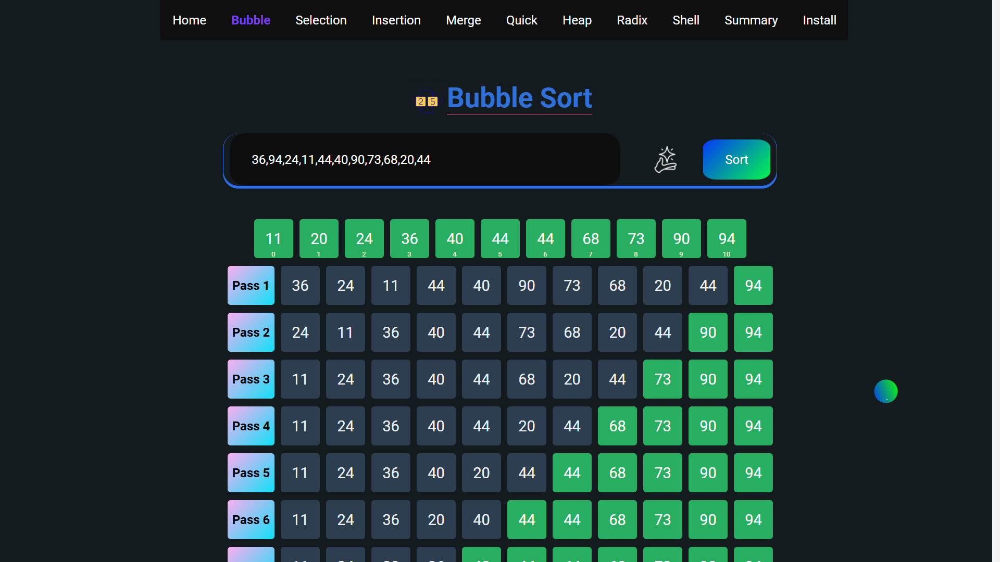
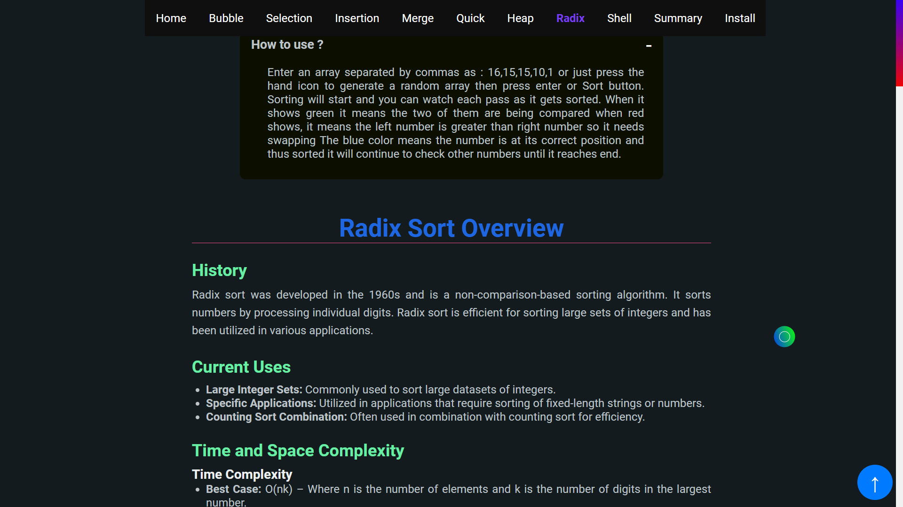
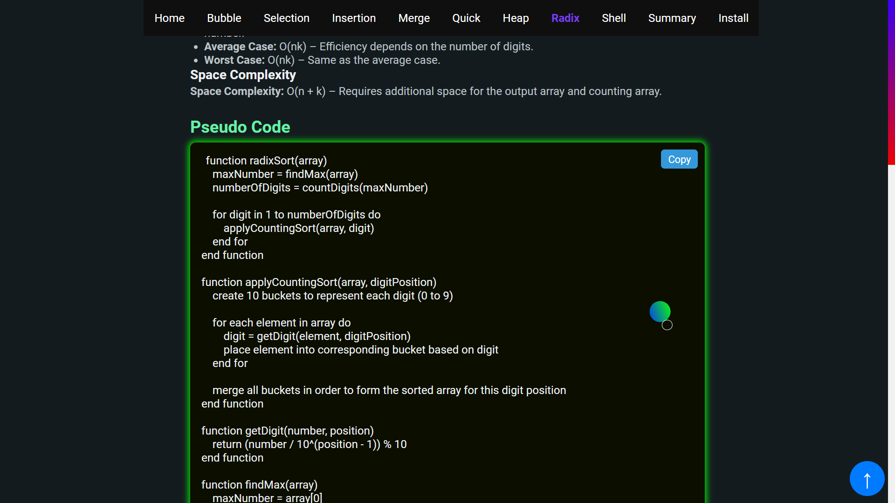
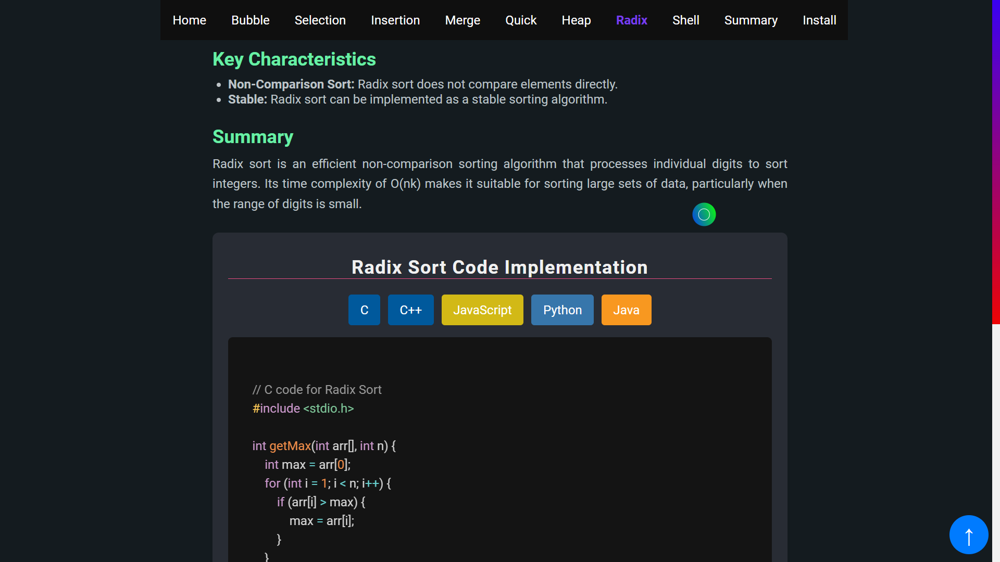
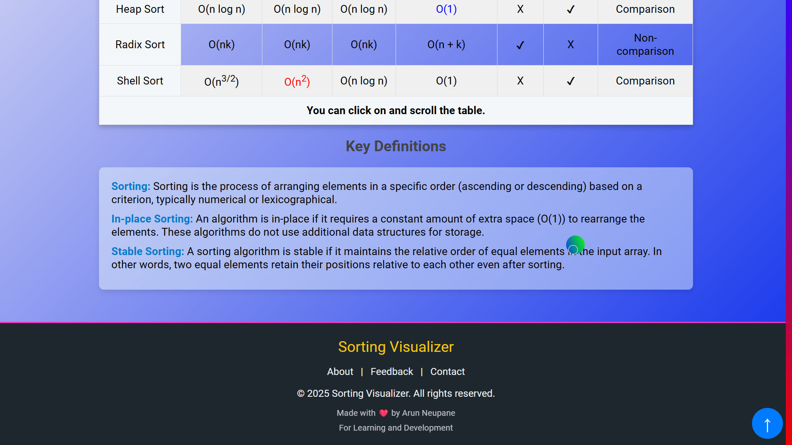
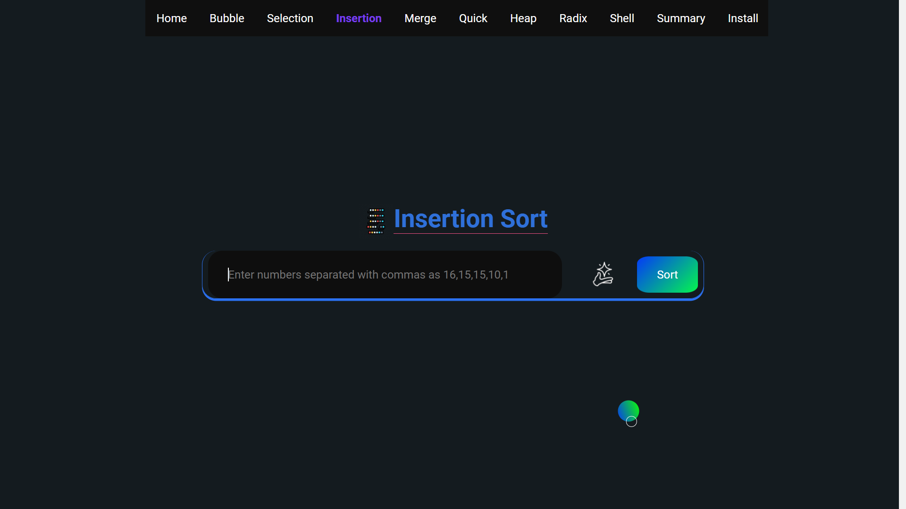
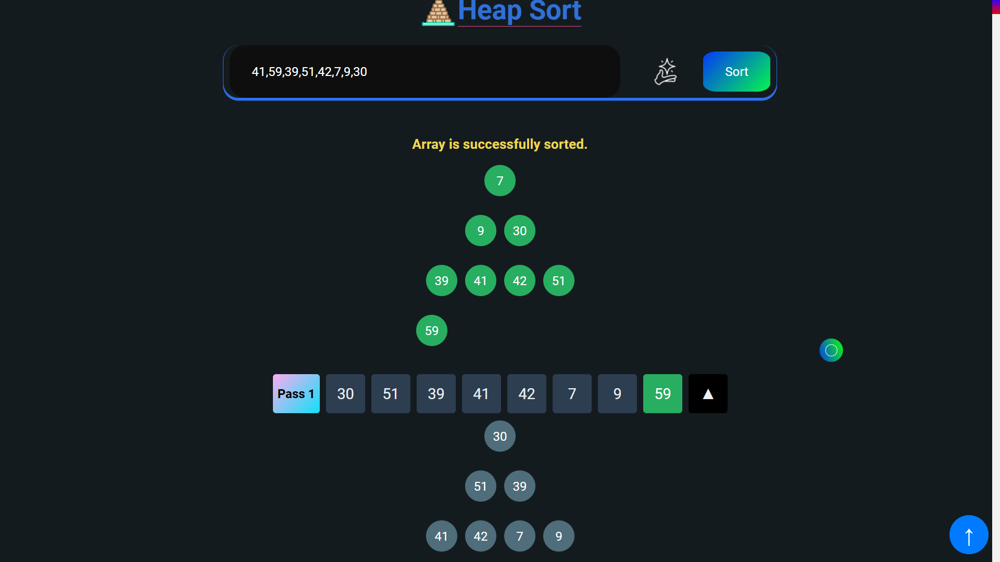

# EasySorting : Sorting Algorithm Visualizer

Welcome to the **EasySorting**, an interactive tool to help you understand how various sorting algorithms work step by step. The project visualizes sorting algorithms in real-time, making it easier to learn the process behind each algorithm and compare their performance.

---

## Preview

## 🚀 Features

- **Real-time Visualization:** Watch how different sorting algorithms manipulate data step-by-step in each iteration.
- **Clean UI:** Clean and Clear UI for no distraction and smooth learning experience.
- **Supported Algorithms:** Visualize popular sorting algorithms such as:
  - Bubble Sort
  - Selection Sort
  - Insertion Sort
  - Merge Sort
  - Quick Sort, Randomized Quick Sort
  - Heap Sort
  - Radix Sort
  - Shell Sort
- **Customizable Inputs:** Adjust the array size and speed of sorting to customize your learning experience.
- **Pseudo-Code:** Pseudo Code for each algorithm available.
- **Code Implementation:** Each algorithm implemented in 5 different programming languages with dummy example run.

---

## 🌟 Demo

Check out the live version of the Sorting Algorithm Visualizer here: [Sorting Algorithm Visualizer](https://easysorting.netlify.app)

---

## 🛠️ Tech Stack

The **Sorting Algorithm Visualizer** is built using the following technologies:

- **Frontend:**
  - HTML, CSS, JavaScript

---

## 📄 Contributing

If you'd like to contribute to **Sorting Algorithm Visualizer**, feel free to fork the repository and submit a pull request. Here's how:

1. Fork the repository
2. Create a new branch for your feature or bugfix (`git checkout -b feature-name`)
3. Commit your changes (`git commit -am 'Add new feature'`)
4. Push to the branch (`git push origin feature-name`)
5. Open a pull request

---

### 🌐 Connect with Me

I'm always open to collaborating on interesting projects or just chatting about tech!
Feel free to reach out through any of the platforms below:

 

_Made with ❤️ and a bit of Passion._

Made By **Arun Neupane**
**For educational purpose** on **code_with_ease** youtube channel.

I hereby declare anybody can use this code to their liking, but i donot give any permission over images , music or names used in this code so keep that in mind.

_Couldn't use it ?_
**Tutorial Link**: https://youtu.be/uWEsZKv1M4k
My youtube channel : https://youtube.com/@arundada9000

_Thanks for checking out **EasySorting**! Happy learning!_ 🎉
